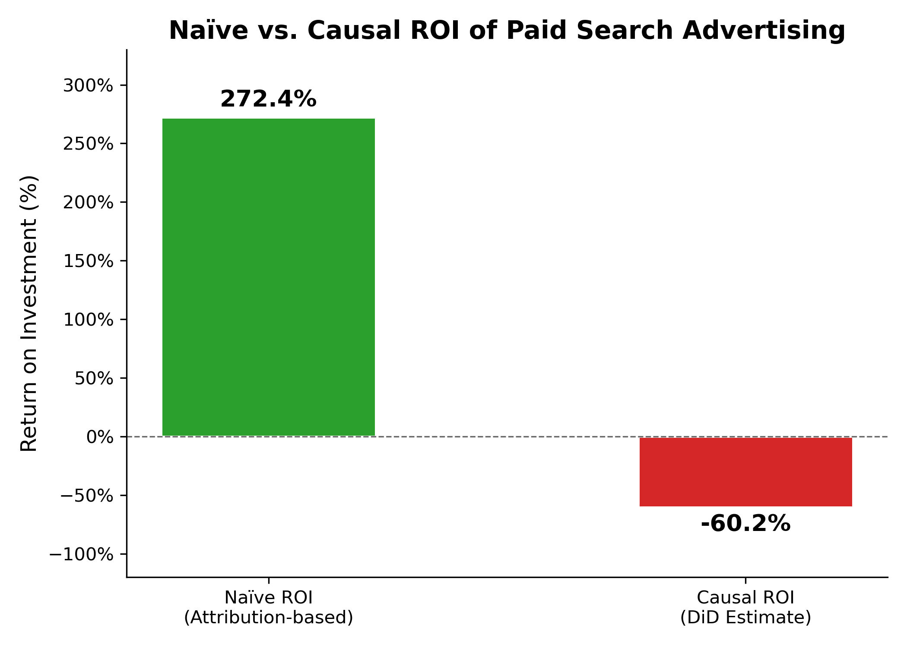
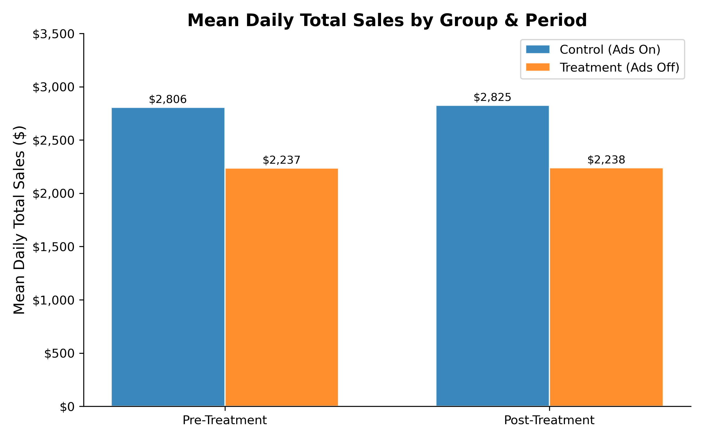
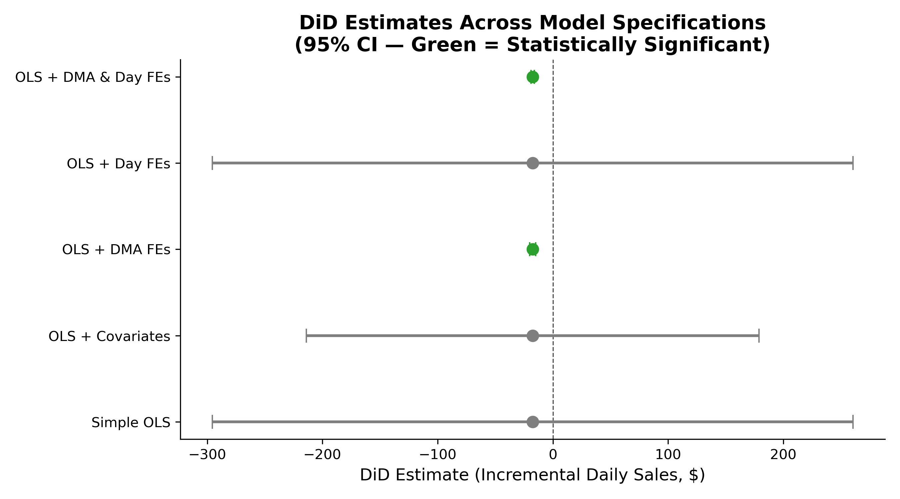
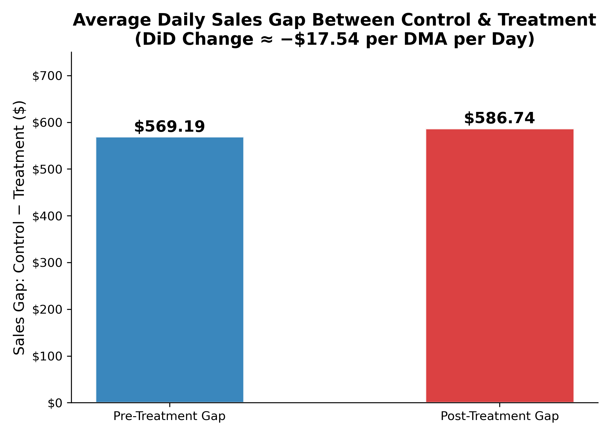

# eBay Paid Search Causal Analysis

A geo-based randomized experiment measuring the **true incremental impact of paid search advertising** on eBay total sales — contrasting naïve attribution with rigorous causal methods.

## Problem

eBay relied on standard click-attribution metrics to evaluate the ROI of its paid search campaigns. Attribution-based approaches systematically overstate ad effectiveness because they credit conversions to paid clicks even when the customer would have purchased anyway through organic search. To address this, eBay ran a geo-randomized experiment: paid search ads were suspended in a randomly selected set of U.S. Designated Market Areas (DMAs) while remaining active in others. The core question is whether the resulting difference in sales — properly adjusted for pre-existing regional differences — reflects the **causal** value of paid search.

---

## Key Findings

- **Naïve ROI: +272%** — the figure a traditional attribution dashboard would report.
- **Causal ROI: −60%** — the true incremental return after accounting for organic substitution, estimated from a Difference-in-Differences (DiD) regression.
- The treatment (ad suspension) caused a statistically significant **decline of ~$17.54 in daily total sales per DMA** (95% CI: −$19.04 to −$16.04 using the fully specified two-way fixed effects model).
- The gap of **>330 percentage points** between naïve and causal ROI quantifies how severely attribution can mislead budget decisions.
- Despite the negative causal ROI, **organic traffic partially compensated** for lost paid clicks, confirming that a meaningful share of attributed sales were not truly incremental.



---

## Dataset

The dataset covers **18,200 DMA-day observations** across approximately 200 U.S. DMAs and ~91 days (split into a ~45-day pre-period and a ~46-day post-period).

| Variable | Description |
|---|---|
| `DMA` / `Code` | Designated Market Area name and numeric code |
| `Treatment` | 1 = ad suspension applied (68 DMAs); 0 = control |
| `Post` | 1 = post-treatment period; 0 = pre-treatment |
| `AdSpend` | Daily paid search advertising spend ($) |
| `PaidClicks` / `OrganicClicks` | Daily clicks from paid and organic channels |
| `TotalSales` | Total daily sales revenue ($) — primary outcome |
| `SalesAds` | Sales attributed to paid search arrivals |
| `Population`, `MedianHHIncome`, `Broadband`, `Urbanization`, `eCommIndex` | DMA-level demographic and digital adoption covariates |

---

## Methodology

### Experimental Design
Treatment DMAs were randomly selected, enabling causal identification. Pre-treatment equivalence was partially violated in raw averages (control DMAs generated ~$569/day more in sales than treatment DMAs before the experiment), underscoring the need for a method that controls for baseline differences.

### Naive ROI Benchmark
Using pre-period data only, attributed sales versus ad spend yield a ~272% return — an upper bound inflated by non-incremental attributions.

### Difference-in-Differences (DiD)
The core causal framework compares the *change* in the sales gap between treatment and control groups from the pre- to the post-period, netting out structural differences. Four progressively richer OLS specifications were estimated:

| Model | DiD Estimate | 95% CI | Statistically Significant? |
|---|---|---|---|
| Simple OLS | −$17.54 | (−$295.50, +$260.42) | No |
| OLS + Covariates | −$17.54 | (−$213.89, +$178.80) | No |
| **OLS + DMA Fixed Effects** | −$17.54 | (−$20.22, −$14.86) | **Yes** |
| OLS + Day Fixed Effects | −$17.54 | (−$295.54, +$260.46) | No |
| **OLS + DMA & Day Fixed Effects** | −$17.56 | (−$19.04, −$16.04) | **Yes** |

DMA fixed effects eliminate between-region noise (e.g. New York vs. a small midwestern market), explaining why they dramatically narrow the confidence interval. Time fixed effects add little additional precision in this dataset, but the two-way FE specification is preferred for robustness. The parallel trends assumption — that treatment and control DMAs would have followed the same trajectory absent intervention — is a necessary identifying condition; its plausibility is supported by random assignment of treated DMAs.

### Parallel Trends Check
The notebook now includes an explicit validation step for the DiD identifying assumption. First, pre-treatment sales paths are plotted for treatment and control DMAs, both in raw levels and normalized to each group's pre-period mean, showing broadly similar movement before the intervention. Second, a formal pre-trend regression is estimated on the pre-period only:

`TotalSales ~ Treatment * DayIndex + C(DMA)`

The interaction term `Treatment x DayIndex` is small and statistically insignificant (`-0.0550`, `p = 0.4504`, 95% CI `[-0.1976, 0.0877]`), which is consistent with parallel pre-treatment trends. This does not prove the assumption, but it meaningfully strengthens the credibility of the DiD design relative to relying on randomization alone.

### Causal ROI Estimation
A second DiD regression with `AdSpend` as the outcome estimates the counterfactual ad spend that would have occurred in treatment DMAs. Combining the incremental sales and incremental ad spend estimates yields the causal ROI of −60%, reflecting a scenario where paid search generated less than $0.60 of incremental sales for every $1.00 spent.

### Synthetic Control (Philadelphia Showcase)
As a complementary case study, the Synthetic Control Method was applied to Philadelphia DMA (Code 504). This approach optimally weights control DMAs to construct a pre-treatment match for Philadelphia on sales, ad spend, and demographic covariates, providing a unit-level counterfactual without requiring the parallel trends assumption to hold globally.

---

## Results



The pre-treatment sales gap (~$569/day) persisted and slightly widened post-treatment (~$587/day), providing a DiD estimate of −$17.54/DMA/day. After controlling for DMA fixed effects, this estimate is both stable across specifications and highly statistically significant.



The consistent point estimate across all models (-$17.54 to -$17.56) confirms robustness. The variance in statistical significance stems entirely from model precision — DMA fixed effects absorb the dominant source of noise (cross-sectional heterogeneity in market size), not from changes to the underlying estimate.



The widening of the control-minus-treatment sales gap from pre to post confirms that turning off ads had a small but measurable negative effect on sales in treatment DMAs relative to the counterfactual.

The added parallel trends diagnostics point in the same direction: treatment and control DMAs track similarly before the intervention, and the post-treatment divergence appears only after ads are turned off in treated markets. That pattern supports interpreting the DiD estimate as causal rather than as an artifact of differential pre-existing trends.

---

## Conclusion

Paid search advertising generates **negative causal ROI** for eBay at the scale studied. The naïve attribution-based figure of +272% is a significant overstatement driven by organic substitution — many users who clicked paid ads would have purchased through organic channels regardless. This finding aligns with documented results in the academic literature on large-scale paid search experiments (e.g., Blake, Nosko & Tadelis, 2015).

**Business implication:** eBay could materially reduce its search advertising budget without a proportional decline in total sales. Budget reallocation to higher-ROI channels or organic search investment may be warranted.

**Limitations:**
- The experiment covers a single seasonal window (~91 days in 2024) and may not generalize to other periods or product categories.
- The parallel trends assumption is now checked in the notebook using both visualization and a pre-period regression test; the evidence is supportive rather than definitive, since no diagnostic can fully prove the counterfactual trend would have remained parallel after treatment.
- Durbin-Watson statistics indicate residual autocorrelation in OLS models; cluster-robust standard errors at the DMA level would further strengthen inference.
- The Synthetic Control analysis for Philadelphia was computationally intensive and could not be completed in the experimental session.

---

## Repository Structure

```
eBay-paid-search-causal-analysis/
├── eBay.ipynb           # Full analysis notebook (exploratory + causal modeling)
├── generate_charts.py   # Script to reproduce all README visualizations
├── data/
│   └── eBay.csv         # DMA-level panel dataset
├── outputs/
│   ├── naive_vs_causal_roi.png
│   ├── mean_sales_treatment_vs_control.png
│   ├── did_model_comparison.png
│   └── sales_gap_pre_post.png
└── README.md
```

---

## How to Run

```bash
# Install dependencies
pip install pandas statsmodels scipy matplotlib pysyncon

# Open the analysis notebook
jupyter notebook eBay.ipynb

# Regenerate README charts
python generate_charts.py
```

The notebook is self-contained and sequential; cells require execution in order. The `data/eBay.csv` file must be present in the `data/` subdirectory.

---

## Visualization Code

```python
# See generate_charts.py for the full chart generation script.
# Abbreviated example: Naive vs. Causal ROI bar chart

import matplotlib.pyplot as plt
import matplotlib.ticker as mtick

labels = ["Naïve ROI\n(Attribution-based)", "Causal ROI\n(DiD Estimate)"]
values = [272.40, -60.23]
colors = ["#2CA02C", "#D62728"]

fig, ax = plt.subplots(figsize=(7, 5))
ax.bar(labels, values, color=colors, width=0.45)
ax.axhline(0, color="black", linewidth=0.8, linestyle="--")
ax.yaxis.set_major_formatter(mtick.PercentFormatter())
ax.set_title("Naïve vs. Causal ROI of Paid Search Advertising")
plt.tight_layout()
plt.savefig("outputs/naive_vs_causal_roi.png", dpi=300)
```

*Generated using Python (pandas, statsmodels, matplotlib) on DMA-day panel data from a 2024 eBay geo-experiment.*
